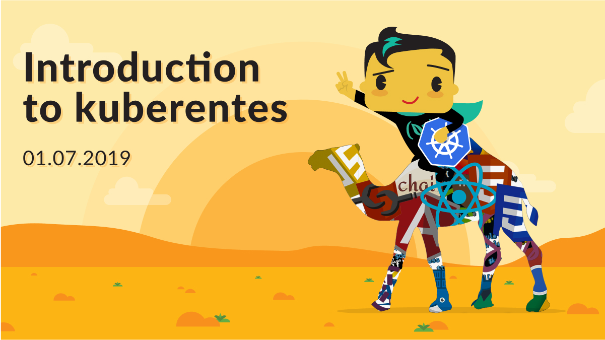

* [Negev Web Developer](https://www.meetup.com/NegevDev)
* Link to meetup [event](https://www.meetup.com/NegevDev/events/261485537/)

## Requirements
### Tools:
* docker, docker-for-[mac](https://docs.docker.com/docker-for-mac/install/)/[win](https://docs.docker.com/docker-for-windows/)
* kubernetes cluster
* [kubectl](https://kubernetes.io/docs/tasks/tools/install-kubectl/) configured to work with the cluster
### Registred account in:
* [dockerhub](https://hub.docker.com)
* [github](https://github.com)

### Locally cloned repositories:
* [docker-chat](https://github.com/ageapps/docker-chat)
* [microservices-demo](https://github.com/olegsu/microservices-demo)

### Docker images
please pull those images before the workshop starts
`docker pull ...`
* gcr.io/google-samples/microservices-demo/emailservice:v0.1.1
* gcr.io/google-samples/microservices-demo/checkoutservice:v0.1.1
* gcr.io/google-samples/microservices-demo/recommendationservice:v0.1.1
* gcr.io/google-samples/microservices-demo/frontend:v0.1.1
* gcr.io/google-samples/microservices-demo/paymentservice:v0.1.1
* gcr.io/google-samples/microservices-demo/productcatalogservice:v0.1.1
* gcr.io/google-samples/microservices-demo/cartservice:v0.1.1
* gcr.io/google-samples/microservices-demo/currencyservice:v0.1.1
* gcr.io/google-samples/microservices-demo/shippingservice:v0.1.1
* gcr.io/google-samples/microservices-demo/adservice:v0.1.1
* redis:alpine
* mongo:latest